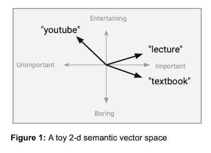
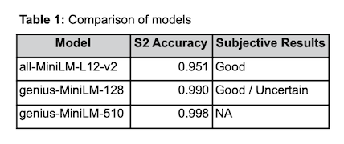

# Semantic Song Search
- We allow the user to search for songs based on the inherent meaning in the song's lyrics. This approach goes beyond basic keyword matching to extract semantics independent of specific wording, connecting songs by topics described by the user in arbitrary detail.
- We apply a pre-trained sentence transformer model on an extensive lyrics dataset to create embeddings for each song. These vector representations of natural language are compared in order to find songs similar in meaning to a user-supplied query.
- We go further and develop a novel training method to fine-tune the model to achieve better results in the song lyrics domain. Lastly, we consider additional improvements.
- This is an individual fork of a team project. Credit to @HSavich and @santarabantoosoo for dev work on initial project.
- Read results in our [research paper](research_paper_v1.pdf)

## Research Links:   

- [How to Build a Semantic Search | Towards Data Science](https://towardsdatascience.com/how-to-build-a-semantic-search-engine-with-transformers-and-faiss-dcbea307a0e8)
- [Machine Learning with PyTorch and Scikit-Learn](https://learning.oreilly.com/library/view/machine-learning-with/9781801819312/)
- [Natural Language Processing with Transformers](https://learning.oreilly.com/library/view/natural-language-processing/9781098136789/)
- [Sentence-BERT](https://arxiv.org/abs/1908.10084)
- [SentenceTransformers](https://www.sbert.net/index.html)
- [all-MiniLM-L12-v2 Model](https://huggingface.co/sentence-transformers/all-MiniLM-L12-v2)
- [NLP for Semantic Search](https://www.pinecone.io/learn/fine-tune-sentence-transformers-mnr/)
